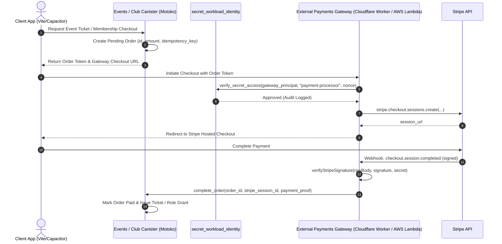
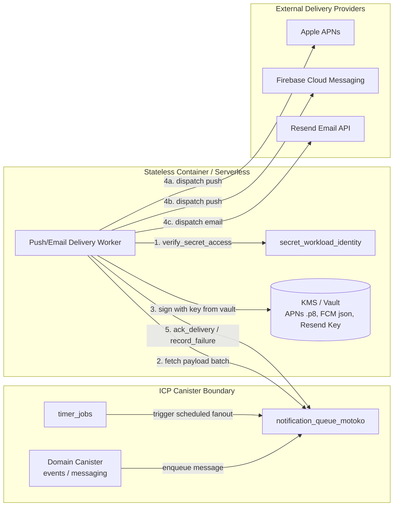

# Edge Secrets, Payments & External Integrations Analysis for ICP

## Executive Summary

In Supabase Edge Functions, backend code relied on ambient environment variables (`Deno.env.get(...)`) containing raw API keys, service role tokens, and master credentials. 

On the Internet Computer (ICP), **ordinary canister memory is replicated across all nodes in a subnet and is not suitable for storing plaintext master credentials or third-party API private keys**.

This document outlines the exhaustive inventory of all 41 environment secrets across 181 Edge Functions, and defines the secure ICP architectural patterns to handle:
1. **Payments & Billing** (Stripe Checkouts, In-App Purchases, Webhooks, Reconciliation)
2. **Push & Email Delivery** (APNs, FCM, VAPID, Resend)
3. **External Provider Integrations** (Google Drive, Google Places, PlayHQ Sports Data, Giphy)
4. **AI & LLM Services** (Gemini, Lovable AI)
5. **Secret Governance & Workload Identity** (`secret_workload_identity` canister)

---

## 1. Complete Inventory of Edge Function Secrets

| Environment Secret | Class | Used By Functions | Risk Level | ICP Architecture Pattern |
| :--- | :--- | :--- | :--- | :--- |
| `STRIPE_WEBHOOK_SECRET` | Secret / Webhook | `stripe-webhook` | **Critical** | External Payments Gateway / HTTPS Outcall |
| `stripe_secret_key` (DB/Env) | Secret / Billing | `create-*-checkout`, `cancel-subscription`, `reconcile-legacy-subscriptions` | **Critical** | External Payments Gateway with Workload Identity |
| `RESEND_API_KEY` | Secret / Email | `send-email`, `send-*-email`, `send-feedback-email` | **High** | External Email Delivery Worker |
| `FCM_PRIVATE_KEY` / `SERVICE_ACCOUNT` | Secret / Push | `send-fcm-notification`, `process-push-delivery-queue` | **High** | External Push Delivery Worker |
| `VAPID_PRIVATE_KEY` | Secret / Web Push | `check-vapid-key`, `process-push-delivery-queue` | **High** | External Push Delivery Worker |
| `GOOGLE_CLIENT_SECRET` / `CLIENT_ID` | Secret / OAuth | `drive-folder-sync`, `google-drive-import`, `resolve-drive-titles` | **High** | External Regional OAuth Worker |
| `GOOGLE_PLACES_API_KEY` | Secret / Places | `google-places-search` | **Medium** | ICP HTTPS Outcall (Rate-limited) or External Worker |
| `GEMINI_API_KEY` / `LOVABLE_API_KEY` | Secret / AI | `summarize-chat`, `summarize-chat-icp`, `icp-llm-test` | **Medium** | External AI Gateway or HTTPS Outcall |
| `GIPHY_API_KEY` | Secret / Media | `giphy-search` | **Low** | ICP HTTPS Outcall with response consensus |
| `SUPABASE_SERVICE_ROLE_KEY` | Master DB Secret | All internal Edge Functions | **Critical** | **Decommissioned on ICP** (Replaced by Canister Principal & Governor RBAC) |
| `CRON_SECRET` / `AUTO_RSVP_DM_CRON_SECRET` | Internal Token | `auto-*-cron`, `process-scheduled-messages` | **Medium** | **Decommissioned on ICP** (Replaced by native canister `Timer` callbacks) |

---

## 2. Detailed Architecture: Payments & Subscriptions (Stripe & IAP)

### 2.1 The Challenge
Stripe APIs require secret keys (`sk_live_...`) to create checkout sessions, manage subscriptions, and process webhooks with cryptographic HMAC verification (`STRIPE_WEBHOOK_SECRET`). Canisters cannot store raw Stripe secret keys.

### 2.2 ICP Solution: External Trusted Payments Gateway + Workload Identity

### 2.3 Payment Invariant Guarantees
1. **Zero Secret Exposure**: Canisters never store, see, or transmit Stripe secret keys.
2. **Replay & Fraud Protection**: `order_id` is created on-canister with strict state transitions (`#Pending` $\rightarrow$ `#Completed` $\rightarrow$ `#Refunded`).
3. **Double-Spend Prevention**: Idempotency keys are checked at both the Stripe API level and the canister mutation level.

---

## 3. Detailed Architecture: Push & Email Delivery

### 3.1 The Challenge
Sending push notifications (Apple APNs via JWT, Firebase FCM via Service Account OAuth, Web Push via VAPID ECDSA) and emails (Resend API key) requires holding private signing keys.

### 3.2 ICP Solution: Asynchronous Queue + Pull-Based Delivery Workers

### 3.3 Delivery Invariants
1. **Canister Pull Pattern**: Workers pull from `notification_queue_motoko.claim(now, batchSize)` using lease locks (5 min timeout).
2. **Least Privilege**: The push worker principal is only authorized for `send-push-notification` scope in `secret_workload_identity`. It cannot read payment secrets or PII.
3. **Automatic Dead-Letter Handling**: After 3 failed delivery attempts with exponential backoff, jobs transition to `#DeadLetter` for diagnostic review.

---

## 4. Detailed Architecture: Third-Party External APIs

### 4.1 ICP HTTPS Outcalls vs External Regional Workers

| External API | Integration Mechanism | Why Selected | Consensus & Transform Rules |
| :--- | :--- | :--- | :--- |
| **Google Places Search** | **ICP HTTPS Outcall** | Low data volume, public venue queries | Sanitized HTTP request; consensus filter extracts place ID, name, lat/lng |
| **Giphy Search** | **ICP HTTPS Outcall** | Read-only public gif search | Response transform extracts gif URLs and IDs |
| **PlayHQ Sports Sync** | **External Regional Worker** | Large payload syncs, multipart streaming, regional rate limits | Worker syncs with PlayHQ, batches fixture diffs, and submits concise updates to `competition_domain_motoko` |
| **Google Drive Import** | **External Regional Worker** | Requires OAuth2 user refresh tokens and file chunk streaming | Handles OAuth token exchange, streams files to external encrypted storage, records metadata in `media_metadata_motoko` |
| **AI / Chat Summaries (Gemini)** | **HTTPS Outcall or External Worker** | LLM summarization with PII minimization | Prompts are sanitized (no PII); HTTPS outcall fetches summary with deterministic temperature consensus |

---

## 5. Security Summary & Compliance Checklist

- [x] **No Raw Credentials in Wasm**: All API keys, private keys, and service secrets removed from canister source and stable memory.
- [x] **Workload Identity Registered**: All workers register their canister/agent principal with [secret_workload_identity](backend/secret_workload_identity/src/main.mo).
- [x] **Immutable Audit Trail**: All secret authorization checks and PII access events logged to append-only stable arrays.
- [x] **Fail-Closed Integration**: If an external gateway or worker is unreachable, transactions fail closed without state corruption.
- [x] **Production Protected-Hardware Path**: Architected for SEV-SNP Cloud Engine deployment when hardware is enabled, without requiring code refactoring.
