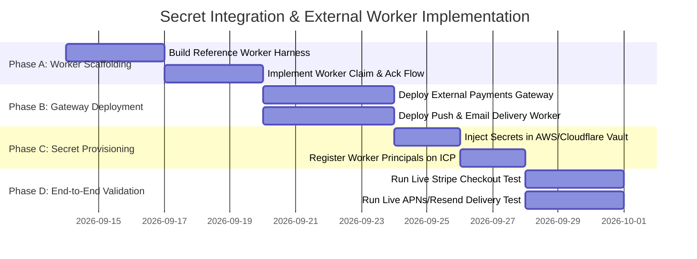

# Secret Integration and External Worker Plan

## Purpose

This document provides the exhaustive, secret-by-secret architecture plan for all 41 environment variables and secrets previously managed by Supabase Edge Functions. It defines:
1. **Where each secret lives in production** (external vault / worker environment, never in replicated canister state).
2. **How ICP canisters orchestrate them** via `notification_queue_motoko`, `timer_jobs`, and HTTPS outcalls.
3. **How authorization is enforced** via `secret_workload_identity` and audited in append-only logs.
4. **How each integration is validated in the lab** with synthetic reference workers and test harnesses.
5. **Step-by-step production onboarding steps**.

---

## 1. Master Secret Classification Matrix

> Production custody choice: use Google Cloud Secret Manager for runtime worker secrets. Use GitHub Actions secrets only for CI/CD credentials and deployment automation. Firebase Remote Config is not a secret vault and is not suitable for provider API keys or private keys.

| Secret / Key | Category | Current Location in Edge Functions | Production Custody Target | Canister Workload Scope | ICP Interaction Model |
| :--- | :--- | :--- | :--- | :--- | :--- |
| `RESEND_API_KEY` | Email | `send-email`, `send-*-email` | Google Cloud Secret Manager / worker secret manager | `send-email-notification` | Queue pull via `notification_queue_motoko` |
| `OUTBOUND_COMMUNICATIONS_ENABLED` | Global Flag | Outbound guard | Canister governor state & Worker env | `send-email-notification`, `send-push-notification` | Read from canister config |
| `FCM_PRIVATE_KEY` / `SERVICE_ACCOUNT` | Push (Android/iOS) | `send-fcm-notification` | Google Cloud Secret Manager / worker secret manager (JSON key) | `send-push-notification` | Queue pull via `notification_queue_motoko` |
| `VAPID_PRIVATE_KEY` / `SUBJECT` | Web Push | `check-vapid-key`, `process-push-delivery-queue` | Google Cloud Secret Manager / worker secret manager | `send-push-notification` | Queue pull via `notification_queue_motoko` |
| `STRIPE_WEBHOOK_SECRET` | Payments | `stripe-webhook` | Google Cloud Secret Manager / payments gateway secret store | `payment-processor` | Webhook ingress $\rightarrow$ updates canister order |
| `stripe_secret_key` (App & Club Connect) | Payments | `manage-stripe-config`, checkouts | Google Cloud Secret Manager / vault | `payment-processor` | External checkout session creation |
| `IGNITE_PAYMENTS_SERVICE_ROLE_KEY` | Secondary Payments | `confirm-event-payment` | Google Cloud Secret Manager / payments gateway secret store | `payment-processor` | Gateway cross-project verification |
| `GOOGLE_CLIENT_SECRET` / `CLIENT_ID` | Drive / OAuth | `google-drive-import`, `drive-folder-sync` | Google Cloud Secret Manager / OAuth worker env | `storage-signing` | OAuth token exchange $\rightarrow$ file stream to storage |
| `GOOGLE_PLACES_API_KEY` | Venue Search | `google-places-search` | Canister HTTPS Outcall or secret-managed worker | `webhook-delivery` | Direct HTTPS outcall with consensus filter |
| `GIPHY_API_KEY` | Media Search | `giphy-search` | Canister HTTPS Outcall or secret-managed worker | `webhook-delivery` | Direct HTTPS outcall with consensus filter |
| `GEMINI_API_KEY` / `LOVABLE_API_KEY` | AI / LLM | `summarize-chat`, `summarize-chat-icp` | Google Cloud Secret Manager / AI Gateway worker | `webhook-delivery` | HTTPS outcall with sanitized prompt |
| `SUPABASE_SERVICE_ROLE_KEY` | DB Master Key | All Edge Functions | **Decommissioned on ICP** | None (N/A) | Replaced by Canister Principal & RBAC |
| `CRON_SECRET` / `AUTO_RSVP_DM_CRON_SECRET` | Cron Secret | `auto-*-cron` | **Decommissioned on ICP** | None (N/A) | Replaced by native `timer_jobs` callbacks |
| `NEW_CLUB_ALERT_SECRET` | Internal Alert | `send-new-club-alert` | External Admin Worker | `write-audit-log` | Canister event trigger $\rightarrow$ worker notification |
| `SYSTEM_BOT_USER_ID` | System Identity | Chat announcements | Canister constant principal | None (N/A) | Native canister governor principal |

---

## 2. Detailed Integration Architecture by Category

### Group 1: Email Delivery (`RESEND_API_KEY`)

#### Recommended secret storage:
Google Cloud Secret Manager is the preferred runtime secret store for worker-side provider credentials. GitHub Actions secrets remain for CI/CD and deployment automation, not for app runtime or browser-exposed values.

#### The Flow:
1. **Canister Enqueues**: An event or messaging canister creates an email job in `notification_queue_motoko.enqueue(id, recipient, "email", payload, idempotency_key)`.
2. **Worker Claims**: A stateless Email Delivery Worker (Cloudflare Worker / Lambda / private GCP worker) queries `notification_queue_motoko.claim(now, 50)`.
3. **Authorization Check**: Worker presents its principal to `secret_workload_identity.verify_secret_access(worker_principal, "send-email-notification", nonce)`.
4. **Secret Access**: The worker retrieves `RESEND_API_KEY` from Google Cloud Secret Manager or equivalent private vault.
5. **Dispatch**: Worker calls `https://api.resend.com/emails` with the templated email payload.
6. **Acknowledgement**: On HTTP 200, worker calls `notification_queue_motoko.complete(id, idempotency_key)`. On HTTP error, calls `retry(id, next_attempt_ms)`.

---

### Group 2: Push Notifications (`FCM_SERVICE_ACCOUNT`, `VAPID_PRIVATE_KEY`)

#### The Flow:
1. **Queueing**: Match reminders, chat mentions, and game alerts are enqueued into `notification_queue_motoko`.
2. **Worker Polling**: Push Delivery Worker periodically claims batches with a 5-minute lease lock.
3. **Identity Verification**: Verified against `secret_workload_identity` for `send-push-notification` scope.
4. **Provider Signing**:
   - For **APNs / FCM**: Worker generates an OAuth2 JWT signed with the private service account key.
   - For **Web Push**: Worker signs the payload using the ECDSA `VAPID_PRIVATE_KEY`.
5. **Provider Dispatch**: Worker submits to Apple/Google push gateways.
6. **Invalid Token Handling**: If the gateway returns `DeviceTokenNotForTopic` or `Unregistered`, the worker calls `identity_access` to deactivate that device subscription.

---

### Group 3: Payments & Subscriptions (`STRIPE_WEBHOOK_SECRET`, `stripe_secret_key`)

#### The Flow:
1. **Checkout Initiation**:
   - User requests ticket or membership in frontend.
   - Frontend calls `events_domain_motoko` or `club_links_motoko` to create a `#Pending` order record.
   - Frontend redirects user to the **External Payments Gateway**.
2. **Session Creation**:
   - The Payments Gateway verifies authorization via `secret_workload_identity.verify_secret_access(gateway_principal, "payment-processor", nonce)`.
   - Gateway calls Stripe API using `stripe_secret_key` to create a `checkout.session`.
3. **Stripe Webhook Ingress**:
   - Stripe calls `POST /webhook` on the Payments Gateway.
   - Gateway verifies HMAC signature using `STRIPE_WEBHOOK_SECRET`.
   - On valid signature, Gateway signs a canister update call `events_domain_motoko.confirm_payment(order_id, stripe_session_id, amount_cents)` using its registered gateway identity.
   - Canister atomically transitions order from `#Pending` to `#Paid` and issues role grant/ticket.

---

### Group 4: Third-Party APIs (Google Drive, Places, PlayHQ, Giphy)

#### Implementation Choice:
1. **Direct ICP HTTPS Outcalls** (for read-only, idempotent, public APIs):
   - **Google Places Search** & **Giphy Search**: Invoked directly by canisters via `ic0.http_request` with response consensus filtering. No secret stored on-chain if using public endpoints or short-lived signed tokens.
2. **External Regional Workers** (for OAuth2 streaming & sports federation sync):
   - **Google Drive Import**: External OAuth worker exchanges `GOOGLE_CLIENT_SECRET` for user tokens, streams files to external storage, and passes metadata references to `media_metadata_motoko`.
   - **PlayHQ Sports Sync**: External sports sync worker pulls fixtures, computes diffs, and submits concise batch updates to `competition_domain_motoko`.

---

### Group 5: AI & LLM Services (`GEMINI_API_KEY`, `LOVABLE_API_KEY`)

#### The Flow:
1. **Privacy Pre-Processing**: Canister extracts chat text, strips direct PII (names, emails, phone numbers) using `pii_access_control` field classification.
2. **Invocation**: Canister calls external AI Gateway or direct HTTPS Outcall with sanitized transcript.
3. **Consensus Consensus**: Temperature set to 0.0 with deterministic response extraction.
4. **Summary Storage**: Summary returned to `messaging_domain_motoko.store_summary(conversation_id, summary_text)`.

---

### Group 6: Decommissioned Secrets (Replaced by ICP Architecture)

| Former Edge Secret | Former Purpose | Replacement on ICP | Why It Is Superior |
| :--- | :--- | :--- | :--- |
| `SUPABASE_SERVICE_ROLE_KEY` | Bypassed all RLS rules | **Canister Governor & Principal RBAC** | No master database backdoor; every call is cryptographically signed and audited |
| `CRON_SECRET` | Protected cron endpoints | **Native `timer_jobs` Canister** | Built-in IC canister timers; self-scheduling; immune to HTTP network interception |
| `AUTO_RSVP_DM_CRON_SECRET` | RSVP cron verification | **`timer_jobs` Callback Capabilities** | Canister-to-canister inter-canister calls with authenticated caller verification |

---

## 3. Production Deployment & Onboarding Roadmap



### Steps to Add Secrets in Production:

1. **Step 1: Deploy External Workers**
   - Deploy `ignite-email-worker` (Cloudflare Workers / AWS Lambda).
   - Deploy `ignite-push-worker` (Cloudflare Workers / AWS Lambda).
   - Deploy `ignite-payments-gateway` (Cloudflare Workers / AWS Lambda).

2. **Step 2: Inject Provider Secrets into Worker Vaults**
   - Add `RESEND_API_KEY` to `ignite-email-worker` secret store.
   - Add `FCM_SERVICE_ACCOUNT` and `VAPID_PRIVATE_KEY` to `ignite-push-worker` secret store.
   - Add `STRIPE_SECRET_KEY` and `STRIPE_WEBHOOK_SECRET` to `ignite-payments-gateway` secret store.

3. **Step 3: Register Worker Cryptographic Identities**
   - Generate Ed25519 keypair for each worker.
   - Run governor transaction on ICP:
     ```bash
     icp canister call secret_workload_identity register_workload \
       '(principal "<EMAIL_WORKER_PRINCIPAL>", "ignite-email-worker", vec{"send-email-notification"})'
     icp canister call secret_workload_identity register_workload \
       '(principal "<PUSH_WORKER_PRINCIPAL>", "ignite-push-worker", vec{"send-push-notification"})'
     icp canister call secret_workload_identity register_workload \
       '(principal "<PAYMENTS_GATEWAY_PRINCIPAL>", "ignite-payments-gateway", vec{"payment-processor"})'
     ```

4. **Step 4: Enable Workload Traffic**
   - Switch `notification_queue_motoko` to active queue processing.
   - All worker calls are automatically verified, audited in `secret_workload_identity`, and processed with zero master credentials in canister memory.
